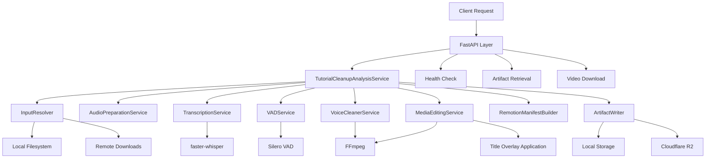

# Tutorial Cleanup API

[](https://github.com)
[](https://github.com)
[](LICENSE)
[](https://www.python.org)
[](https://fastapi.tiangolo.com)

**AI-powered video tutorial processing microservice** — Automatically transcribe, clean, and edit tutorial videos by removing filler words, silence, and off-script content.

---

## Table of Contents

- [Overview](#overview)
- [Architecture](#architecture)
- [Tech Stack](#tech-stack)
- [Repository Structure](#repository-structure)
- [Prerequisites](#prerequisites)
- [Installation & Setup](#installation--setup)
- [Configuration](#configuration)
- [Running the Project](#running-the-project)
- [API Reference](#api-reference)
- [Testing](#testing)
- [Deployment](#deployment)
- [Security](#security)
- [Observability](#observability)
- [Performance](#performance)
- [Contributing](#contributing)
- [Changelog](#changelog)
- [Roadmap](#roadmap)
- [License & Legal](#license--legal)
- [Team & Support](#team--support)

---

## Overview

### Problem Statement

Content creators producing tutorial videos often face significant post-production challenges:
- Manual editing to remove filler words ("um", "uh", "eh"), long silences, and self-corrections
- Time-consuming audio cleanup and normalization
- Difficulty ensuring coverage of all planned script sections
- Repetitive, labor-intensive workflow that scales poorly

### Solution Summary

Tutorial Cleanup API is a microservice that automates the tutorial video editing pipeline using AI/ML technologies:
- **Automatic Transcription**: Uses faster-whisper to generate accurate speech-to-text transcripts with word-level timestamps
- **Voice Activity Detection**: Silero VAD identifies speech regions and silence gaps for intelligent cutting
- **Smart Edit Planning**: Detects and removes filler words, repeated words, self-corrections, and off-script drift
- **Audio Normalization**: FFmpeg-based audio cleaning with highpass/lowpass filters, noise reduction, and loudness normalization
- **Video Editing**: Applies edit plans to generate clean master videos
- **Title Overlays**: Optional text overlays at specified timestamps using FFmpeg
- **Cloud Storage**: Optional upload to Cloudflare R2 for distributed access

### Key Differentiators

- **Multi-format Transcript Support**: Accepts JSON, SRT, VTT, and plain text transcripts, with fallback to local transcription
- **Configurable Edit Rules**: Fine-grained control over detection thresholds, silence duration, and edit priorities
- **Artifact Persistence**: All intermediate results (transcripts, audio, edit plans, diagnostics) are stored and retrievable
- **Script Coverage Analysis**: Compares transcript against provided script PDF to identify missing or overextended topics
- **Production-Ready**: Docker containerized, health checks, Bearer token authentication, environment-based configuration

### Project Status

**Stable** — Version 0.2.0 in active production use within the Vidula ecosystem. Core functionality fully implemented and battle-tested.

---

## Architecture

### High-Level Architecture



### Architectural Pattern

**Layered Service-Oriented Architecture** with clear separation of concerns:

- **Presentation Layer**: FastAPI routes (`main.py`) handling HTTP requests, authentication, and response formatting
- **Application Layer**: `TutorialCleanupAnalysisService` orchestrating the entire cleanup workflow
- **Domain Layer**: Data models (`models.py`) and request/response schemas (`schemas.py`) defining business entities
- **Infrastructure Layer**: Specialized services handling external dependencies (transcription, VAD, media processing, storage)

### Layer Breakdown

| Layer | Components | Responsibility |
|-------|------------|----------------|
| Presentation | `main.py` | HTTP endpoints, Bearer token auth, request/response handling |
| Application | `service.py` | Workflow orchestration, edit planning, coverage analysis |
| Domain | `models.py`, `schemas.py` | Business entities, Pydantic validation, data structures |
| Infrastructure | `transcription.py`, `vad.py`, `cleaner.py`, `editor.py`, `media.py`, `storage.py`, `artifacts.py`, `resolver.py` | External system integration, file I/O, ML inference |

### Key Design Decisions

1. **Service Modularity**: Each processing step (transcription, VAD, cleaning, editing) is encapsulated in its own service class, enabling independent testing and replacement of implementations
2. **Configuration-Driven**: All tunable parameters exposed via environment variables using pydantic-settings, enabling zero-code deployment adjustments
3. **Artifact Persistence Pattern**: Intermediate results stored to disk with UUID-based organization, allowing debugging and re-use without re-processing
4. **Sync Processing Model**: Synchronous API design for simplicity; suitable for current workload
5. **Multi-Source Transcript Strategy**: Prefers existing sidecar transcripts, falls back to local transcription, then to text-based estimation
6. **Priority-Based Edit Selection**: Edit candidates ranked by confidence and priority, with overlap detection to prevent conflicting cuts
7. **Standalone Deployment**: Single container deployment without external dependencies (no database, no message queue)

### Data Flow

1. **Input Resolution**: `InputResolver` locates video and script PDF files (local paths or remote downloads)
2. **Audio Extraction**: `AudioPreparationService` extracts and prepares audio track at 16kHz
3. **Transcription**: `TranscriptionService` uses faster-whisper to generate word-aligned transcript (or loads existing)
4. **VAD Analysis**: `VADService` detects speech regions and silence gaps using Silero VAD
5. **Edit Candidate Generation**: Service builds candidates for fillers, repetitions, self-corrections, off-script drift, long silences
6. **Candidate Selection**: Prioritized selection based on time savings target, with overlap resolution
7. **Audio Cleaning**: `VoiceCleanerService` applies FFmpeg filter chain (highpass, lowpass, denoise, loudnorm)
8. **Video Editing**: `MediaEditingService` applies cuts to generate clean master video
9. **Manifest Generation**: `RemotionManifestBuilder` creates JSON manifest for Remotion composition
10. **Title Overlays**: Optional FFmpeg-based text overlay application
11. **Artifact Storage**: `ArtifactWriter` persists all artifacts and optionally uploads to R2
12. **Response**: Returns summary, coverage, edit plan, artifact URLs, and diagnostics

---

## Tech Stack

| Layer | Technology | Version | Purpose |
|-------|------------|---------|---------|
| Runtime | Python | 3.12-slim | Core runtime environment |
| Framework | FastAPI | 0.122.0 | High-performance async web framework |
| ASGI Server | Uvicorn | 0.38.0 | ASGI server for production deployment |
| Validation | Pydantic | 2.12.0 | Data validation and settings management |
| ML/AI | PyTorch | 2.7.1 | Deep learning framework |
| ML/AI | TorchAudio | 2.7.1 | Audio processing for ML models |
| ML/AI | faster-whisper | 1.2.0 | Fast Whisper transcription engine |
| ML/AI | silero-vad | 6.2.0 | Voice activity detection model |
| ML/AI | onnxruntime | 1.22.0 | ONNX model inference runtime |
| Media Processing | FFmpeg | system | Audio/video encoding, filtering, editing |
| Audio I/O | soundfile | 0.13.1 | Audio file reading/writing |
| PDF Processing | PyMuPDF | 1.26.4 | Script PDF text extraction |
| HTTP Client | httpx | 0.28.1 | Async HTTP client for remote downloads |
| Storage | boto3 | 1.34.0 | AWS S3 / Cloudflare R2 SDK |
| Containerization | Docker | latest | Container image packaging |
| Orchestration | Docker Compose | latest | Multi-container deployment |

### Third-Party Integrations

- **Cloudflare R2**: Object storage for processed video artifacts (optional)
- **Remotion**: React-based video composition framework (manifest generation for external rendering)
- **Vidula Ecosystem**: Laravel-based parent application calling this service

---

## Repository Structure

```
TUTORIAL-CLEANUP-API/
├── app/
│   ├── __init__.py              # Package initialization
│   ├── main.py                  # FastAPI application, routes, authentication
│   ├── config.py                # Pydantic settings, environment configuration
│   ├── models.py                # Domain models (transcript segments, speech regions)
│   ├── schemas.py               # Request/response Pydantic schemas
│   ├── service.py               # Main orchestrator service (TutorialCleanupAnalysisService)
│   ├── artifacts.py             # Artifact file locator and writer
│   ├── resolver.py              # Input file resolution (local/remote)
│   ├── media.py                 # Audio preparation service
│   ├── transcription.py         # Whisper-based transcription service
│   ├── vad.py                   # Voice activity detection service
│   ├── cleaner.py               # Audio cleaning/normalization service
│   ├── editor.py                # Video editing and title overlay service
│   ├── storage.py               # R2/S3 storage integration
│   └── remotion_manifest.py     # Remotion composition manifest builder
├── .dockerignore                # Docker build exclusions
├── .env.example                 # Environment variable template
├── Dockerfile                   # Container image definition
├── docker-compose.yml           # Multi-container orchestration
├── requirements.txt            # Python dependencies
└── README.md                    # This file
```

### Directory Responsibilities

- **`app/`**: Python package containing all application code
  - `main.py`: Entry point, HTTP endpoints (`/health`, `/analysis/jobs/sync`, `/artifacts`, `/download`)
  - `config.py`: Centralized configuration with 50+ tunable parameters
  - `service.py`: Core business logic orchestrating the entire pipeline
  - `models.py`: Internal data structures (transcript segments, speech regions, edit candidates)
  - `schemas.py`: API request/response models with validation
  - `infrastructure/` (implicit): External system integrations (transcription, VAD, FFmpeg, storage)

---

## Prerequisites

### OS Requirements

- **Linux**: Ubuntu 20.04+, Debian 11+, or any modern Linux distribution
- **Windows**: Windows 10/11 with WSL2 recommended (native Windows supported with FFmpeg)
- **macOS**: macOS 11+ (Big Sur) or later

### Runtime Versions

- **Python**: 3.12.x (required for PyTorch 2.7.1 compatibility)
- **pip**: 23.0 or later
- **FFmpeg**: 4.4 or later (system package or binary)
- **Docker**: 24.0 or later (for containerized deployment)
- **Docker Compose**: 2.20 or later (for orchestration)

### Required CLI Tools

```bash
# Verify installations
python --version      # Python 3.12.x
pip --version         # pip 23.0+
ffmpeg -version       # FFmpeg 4.4+
docker --version      # Docker 24.0+
docker-compose --version  # Docker Compose 2.20+
```

### Hardware Requirements

**Minimum** (CPU-only inference):
- CPU: 4 cores, 2.4 GHz+
- RAM: 8 GB
- Storage: 20 GB free space (for artifacts and models)
- Network: Stable internet connection (for model downloads, optional R2 uploads)

**Recommended** (GPU acceleration):
- GPU: NVIDIA GPU with CUDA 11.8+ support (RTX 3060 or better)
- CPU: 8 cores, 3.0 GHz+
- RAM: 16 GB
- Storage: 50 GB SSD
- Network: High-bandwidth connection

### Required Accounts / Credentials

- **Cloudflare R2** (optional): Account ID, Access Key ID, Secret Access Key, Bucket Name
- **API Token**: Bearer token for service authentication (configure via `TUTORIAL_CLEANUP_API_TOKEN`)

> **⚠️ Warning:** Never commit credentials to version control. Use environment variables or secret management systems.

---

## Installation & Setup

### Local Development Environment

#### 1. Clone Repository

```bash
git clone <repository-url>
cd TUTORIAL-CLEANUP-API
```

#### 2. Create Virtual Environment

```bash
# Python 3.12 required
python -m venv venv

# Activate (Linux/macOS)
source venv/bin/activate

# Activate (Windows)
venv\Scripts\activate
```

#### 3. Install Dependencies

```bash
pip install --upgrade pip
pip install -r requirements.txt
```

#### 4. Install FFmpeg

```bash
# Ubuntu/Debian
sudo apt-get update
sudo apt-get install -y ffmpeg

# macOS (Homebrew)
brew install ffmpeg

# Windows (Chocolatey)
choco install ffmpeg
```

#### 5. Configure Environment Variables

```bash
# Copy example environment file
cp .env.example .env

# Edit .env with your configuration
# Minimum required:
export TUTORIAL_CLEANUP_API_TOKEN="your-secure-token-here"
export TUTORIAL_CLEANUP_ARTIFACT_ROOT="/tmp/vidula/tutorial-cleanup-api"
```

### Docker / Docker Compose Setup

#### 1. Build Docker Image

```bash
docker build -t tutorial-cleanup-api:latest .
```

#### 2. Run with Docker Compose

```bash
# Start service
docker-compose up -d

# View logs
docker-compose logs -f tutorial-cleanup-api

# Stop service
docker-compose down
```

#### 3. Verify Deployment

```bash
curl http://localhost:8001/health
```

**Docker Compose Configuration**:
- **Container name**: `vidula-tutorial-cleanup-api`
- **Host port**: `8001` (maps to container port `8000`)
- **Volumes**:
  - `../../:/workspace:ro` - Read-only workspace mount for input files
  - `tutorial_cleanup_artifacts:/data/artifacts` - Named volume for artifact persistence
- **Restart policy**: `unless-stopped`

### Environment Variables

**Docker Compose Configuration** (from docker-compose.yml):

| Variable | Default | Description |
|----------|---------|-------------|
| `TUTORIAL_CLEANUP_API_TOKEN` | `Q3rjv9LwX2mN8pK6sT1zY4aB7cD0eF5gH9jK2mP4rS6uV8xZ1nC3qW5yR7tU9iO` | Bearer token for API authentication. Empty disables auth. |
| `TUTORIAL_CLEANUP_ARTIFACT_ROOT` | `/data/artifacts` | Root directory for artifact storage. |
| `TUTORIAL_CLEANUP_LOCAL_INPUT_ROOTS` | `/workspace` | Local directories to search for input files. |
| `TUTORIAL_CLEANUP_PATH_MAP_FROM` | `""` | Source path prefix for path mapping. |
| `TUTORIAL_CLEANUP_PATH_MAP_TO` | `""` | Destination path prefix for path mapping. |

**Additional Configuration** (from app/config.py):

| Variable | Default | Description |
|----------|---------|-------------|
| `TUTORIAL_CLEANUP_ALLOW_REMOTE_DOWNLOADS` | `true` | Enable HTTP/HTTPS remote file downloads. |
| `TUTORIAL_CLEANUP_DOWNLOAD_TIMEOUT_SECONDS` | `120` | Timeout for remote downloads. |
| `TUTORIAL_CLEANUP_TRANSCRIPTION_MODEL_SIZE` | `tiny` | Whisper model size: tiny, base, small, medium, large. |
| `TUTORIAL_CLEANUP_WHISPER_DEVICE` | `cpu` | Inference device: cpu, cuda. |
| `TUTORIAL_CLEANUP_DEFAULT_LANGUAGE` | `es` | Default language code for transcription. |
| `TUTORIAL_CLEANUP_WORDS_PER_MINUTE` | `130` | Estimated speech rate for duration calculations. |
| `TUTORIAL_CLEANUP_MAX_EDIT_PLAN_ITEMS` | `30` | Maximum number of edit operations per job. |
| `TUTORIAL_CLEANUP_REMOTION_COMPOSITION_ID` | `TutorialCapcutClean` | Remotion composition identifier. |
| `TUTORIAL_CLEANUP_REMOTION_FPS` | `30` | Video frame rate for rendering. |
| `TUTORIAL_CLEANUP_REMOTION_WIDTH` | `1080` | Video width in pixels. |
| `TUTORIAL_CLEANUP_REMOTION_HEIGHT` | `1920` | Video height in pixels. |

**Cloudflare R2 Storage** (optional):

| Variable | Default | Description |
|----------|---------|-------------|
| `TUTORIAL_CLEANUP_R2_ACCOUNT_ID` | `""` | Cloudflare R2 account ID. |
| `TUTORIAL_CLEANUP_R2_ACCESS_KEY_ID` | `""` | Cloudflare R2 access key. |
| `TUTORIAL_CLEANUP_R2_SECRET_ACCESS_KEY` | `""` | Cloudflare R2 secret key. |
| `TUTORIAL_CLEANUP_R2_BUCKET_NAME` | `""` | Cloudflare R2 bucket name. |
| `TUTORIAL_CLEANUP_R2_ENDPOINT` | `""` | Cloudflare R2 endpoint URL. |
| `TUTORIAL_CLEANUP_R2_PUBLIC_BASE_URL` | `""` | Public base URL for R2 objects. |

> **💡 Tip:** For production, set `TUTORIAL_CLEANUP_API_TOKEN` to a strong random string. Configure R2 credentials only if cloud storage is needed.

### Database Migrations / Seed Data

**Not applicable** — This service is stateless and does not use a database. All data is stored as files in the artifact directory.

---

## Configuration

### Config Files Explained

- **`.env`**: Environment variables for local development. Not committed to version control.
- **`.env.example`**: Template showing essential configuration options.
- **`requirements.txt`**: Python package dependencies with pinned versions.
- **`Dockerfile`**: Container image based on python:3.12-slim with FFmpeg, libgomp1, libsndfile1.
- **`docker-compose.yml`**: Single service orchestration with volume mounts and port mapping (8001:8000).

### Feature Flags

| Flag | Environment Variable | Default | Description |
|------|---------------------|---------|-------------|
| Enable Local Transcription | `TUTORIAL_CLEANUP_ENABLE_LOCAL_TRANSCRIPTION` | `true` | Enable/disable faster-whisper transcription. |
| Prefer Existing Transcripts | `TUTORIAL_CLEANUP_PREFER_EXISTING_TRANSCRIPT_SIDECARS` | `true` | Prioritize sidecar transcript files over re-transcription. |
| VAD ONNX Runtime | `TUTORIAL_CLEANUP_VAD_USE_ONNX` | `false` | Use ONNX runtime for VAD instead of PyTorch. |
| Whisper VAD Filter | `TUTORIAL_CLEANUP_WHISPER_VAD_FILTER` | `false` | Enable Whisper's built-in VAD filter. |

### Environment-Specific Overrides

| Environment | Override Method |
|-------------|-----------------|
| **Development** | Set `TUTORIAL_CLEANUP_API_TOKEN=""` to disable auth. Use local filesystem for artifacts. |
| **Staging** | Configure R2 storage with staging bucket. Enable debug logging. |
| **Production** | Set strong API token. Configure R2 with production bucket. Disable debug logging. Use GPU if available. |

---

## Running the Project

### Development Mode

```bash
# Activate virtual environment
source venv/bin/activate  # Linux/macOS
# or
venv\Scripts\activate     # Windows

# Set environment variables
export TUTORIAL_CLEANUP_API_TOKEN="dev-token"
export TUTORIAL_CLEANUP_ARTIFACT_ROOT="./artifacts"

# Run with auto-reload (requires uvicorn[standard])
uvicorn app.main:app --host 0.0.0.0 --port 8000 --reload
```

### Production Build

```bash
# Using Docker Compose
docker-compose up -d

# Using Docker directly
docker run -d \
  -p 8001:8000 \
  -e TUTORIAL_CLEANUP_API_TOKEN="prod-token" \
  -v $(pwd)/artifacts:/data/artifacts \
  tutorial-cleanup-api:latest
```

### Available Scripts

| Script | Description |
|--------|-------------|
| `uvicorn app.main:app --host 0.0.0.0 --port 8000` | Start production server |
| `uvicorn app.main:app --reload` | Start development server with auto-reload |
| `docker-compose up -d` | Start all services in detached mode |
| `docker-compose down` | Stop all services |
| `docker-compose logs -f` | Follow service logs |
| `pytest` | Run test suite (if tests exist) |

---

## API Reference

### Base URL

- **Local**: `http://localhost:8000`
- **Docker**: `http://localhost:8001`
- **Production**: `https://your-domain.com`

### Authentication Method

**Bearer Token Authentication**

```bash
curl -H "Authorization: Bearer YOUR_TOKEN" http://localhost:8001/health
```

If `TUTORIAL_CLEANUP_API_TOKEN` is empty, authentication is disabled.

### Endpoints

| Method | Path | Description | Auth Required |
|--------|------|-------------|---------------|
| GET | `/health` | Health check endpoint | Optional |
| POST | `/analysis/jobs/sync` | Submit tutorial cleanup job (synchronous) | Required |
| GET | `/artifacts/{job_uuid}/{artifact_key}` | Retrieve job artifact by key | Required |
| GET | `/download/{job_uuid}` | Download final processed video | Required |

### Request/Response Examples

#### Health Check

**Request:**
```bash
GET /health
```

**Response (200 OK):**
```json
{
  "status": "ok",
  "service": "Tutorial Cleanup API",
  "version": "0.2.0"
}
```

#### Analysis Job (Sync)

**Request:**
```bash
POST /analysis/jobs/sync
Authorization: Bearer YOUR_TOKEN
Content-Type: application/json

{
  "job_uuid": "550e8400-e29b-41d4-a716-446655440000",
  "title": "Introduction to Python Programming",
  "language": "es",
  "target_duration_minutes": 60,
  "max_duration_minutes": 70,
  "source": {
    "video_path": "/workspace/tutorials/python-intro.mp4",
    "script_pdf_path": "/workspace/scripts/python-intro.pdf"
  },
  "editorial_prompt": "Focus on core concepts, skip advanced topics",
  "rules": {
    "detect_fillers": true,
    "detect_repeated_words": true,
    "detect_self_corrections": true,
    "silence_threshold_seconds": 1.5,
    "pause_keyword": "pausa",
    "store_artifacts": true
  },
  "title_overlays": [
    {
      "text": "Chapter 1: Variables",
      "start_frame": 0,
      "end_frame": 900
    }
  ]
}
```

**Response (200 OK):**
```json
{
  "job_uuid": "550e8400-e29b-41d4-a716-446655440000",
  "status": "completed",
  "summary": {
    "original_duration_seconds": 720,
    "estimated_final_duration_seconds": 580,
    "time_saved_seconds": 140,
    "learning_objectives_met": true
  },
  "coverage": {
    "sections": [
      {
        "title": "VARIABLES",
        "expected_minutes": 2.5,
        "actual_minutes": 2.3,
        "status": "covered"
      }
    ],
    "missing_topics": [],
    "overextended_topics": []
  },
  "edit_plan": [
    {
      "start": "00:00:12.500",
      "end": "00:00:13.200",
      "action": "reduce",
      "reason": "fillers",
      "observation": "Muletilla detectada: eh.",
      "confidence": 0.74
    },
    {
      "start": "00:01:30.000",
      "end": "00:01:32.500",
      "action": "cut",
      "reason": "long_silence",
      "observation": "Silencio mayor a 1.5s detectado por VAD.",
      "confidence": 0.9
    }
  ],
  "artifacts": {
    "internal_alignment": "artifacts/550e8400.../transcript.json",
    "edit_plan": "artifacts/550e8400.../edit-plan.json",
    "report": "artifacts/550e8400.../report.md",
    "cleaned_audio": "artifacts/550e8400.../cleaned/voice-clean.wav",
    "clean_video": "artifacts/550e8400.../render/clean-master.mp4",
    "final_video": "artifacts/550e8400.../render/final-with-titles.mp4"
  },
  "diagnostics": {
    "script_available": true,
    "script_sections_detected": 5,
    "internal_alignment_source": "internal-alignment:voice-prepared.wav",
    "internal_alignment_segments": 142,
    "selected_actions": 18,
    "silence_regions": 8
  }
}
```

#### Artifact Retrieval

**Request:**
```bash
GET /artifacts/550e8400-e29b-41d4-a716-446655440000/report.md
Authorization: Bearer YOUR_TOKEN
```

**Response (200 OK):**
Returns the file content with appropriate `Content-Type` header.

#### Video Download

**Request:**
```bash
GET /download/550e8400-e29b-41d4-a716-446655440000
Authorization: Bearer YOUR_TOKEN
```

**Response (200 OK):**
Returns the final video file as `video/mp4` with filename `{job_uuid}-final.mp4`.

### Error Codes

| Status Code | Description | Common Causes |
|-------------|-------------|----------------|
| 200 | Success | Request processed successfully |
| 401 | Unauthorized | Missing or invalid Bearer token |
| 404 | Not Found | Artifact file does not exist |
| 422 | Unprocessable Entity | Invalid input files, missing required fields |
| 500 | Internal Server Error | Unexpected processing error |

**Error Response Example (422):**
```json
{
  "detail": "Video file not found: /workspace/tutorials/python-intro.mp4"
}
```

---

## Testing

### Testing Strategy

**Current State**: No automated test suite present in repository (gap identified).

**Recommended Strategy**:

- **Unit Tests**: Test individual service methods in isolation (transcription, VAD, cleaning, editing)
- **Integration Tests**: Test service orchestration with mocked external dependencies
- **End-to-End Tests**: Test full API workflow with real media files
- **Contract Tests**: Validate request/response schemas match API specification

### How to Run Test Suites

**Not yet implemented** — Recommended setup:

```bash
# Install test dependencies
pip install pytest pytest-asyncio pytest-cov httpx

# Run unit tests
pytest tests/unit/ -v

# Run integration tests
pytest tests/integration/ -v

# Run with coverage
pytest --cov=app tests/
```

### Coverage Requirements

**Target**: 80% code coverage minimum for production deployment.

**Current**: 0% (no tests present).

### Mocking Strategy

**Recommended mocking approach**:

- Use `unittest.mock` for external dependencies (FFmpeg, file system, HTTP requests)
- Mock ML model inference in unit tests to avoid heavy dependencies
- Use fixture files for consistent test data (sample audio, video, transcripts)
- Mock R2 storage calls to avoid network dependencies

---

## Deployment

### Deployment Targets

- **On-Premise**: Docker Compose on Linux servers
- **Cloud Provider**: AWS, GCP, Azure (containerized deployment via Docker)

### CI/CD Pipeline Overview

**Current State**: No CI/CD configuration present (gap identified).

**Recommended Pipeline**:


**Stages**:
1. **Lint**: Code style checking with ruff/black
2. **Security**: Dependency scanning with bandit/safety
3. **Test**: Unit and integration tests with pytest
4. **Build**: Docker image build
5. **Scan**: Container vulnerability scanning with Trivy
6. **Deploy**: Staging environment deployment
7. **Validate**: E2E tests on staging
8. **Promote**: Production deployment

### Infrastructure as Code

**Current State**: Docker Compose only.

The service is deployed as a single container with:\n- Port mapping: 8001:8000 (host:container)
- Volume mounts for workspace input (read-only)
- Named volume for artifact persistence
- Environment variables for configuration

### Rollback Procedure

```bash
# Docker Compose rollback
docker-compose down
docker-compose pull tutorial-cleanup-api:previous-version
docker-compose up -d

# Or rebuild from previous code
git checkout <previous-commit>
docker-compose build
docker-compose up -d
```

### Health Check Endpoints

- **GET /health**: Returns service status, version, and availability
- **Recommended interval**: 30 seconds
- **Timeout**: 5 seconds
- **Failure threshold**: 3 consecutive failures before marking unhealthy

---

## Security

### Authentication & Authorization Model

**Authentication**: Bearer token via HTTP `Authorization` header

```python
# Token validation logic (from main.py)
def require_api_token(authorization: str | None = Header(default=None)) -> None:
    expected_token = settings.api_token.strip()
    if expected_token == '':
        return  # Auth disabled
    if authorization is None or not authorization.startswith('Bearer '):
        raise HTTPException(status_code=401, detail='Not authenticated')
    provided_token = authorization.removeprefix('Bearer ').strip()
    if provided_token != expected_token:
        raise HTTPException(status_code=401, detail='Invalid authentication credentials')
```

**Authorization**: Currently single-token model (no role-based access). All authenticated users have full access.

### Secrets Management Approach

**Current**: Environment variables (not recommended for production)

**Recommended**:

- Use environment variables in docker-compose.yml for containerized deployments
- Consider secret management services (AWS Secrets Manager, HashiCorp Vault) for production
- Never commit `.env` files to version control

### Known Security Considerations

- **Path Traversal**: `InputResolver` validates file paths to prevent directory traversal attacks

### Metrics

**Current**: No metrics collection implemented.

**Future enhancements**:
- Add structured logging with job tracking
- Monitor job processing times and success rates when metrics collection is implemented

### Tracing

**Current**: No distributed tracing implemented.

**Future enhancements**:
- Consider adding OpenTelemetry for distributed tracing when integrating with larger systems

### Alerting Rules Summary

**Recommended alerts** (when monitoring is implemented):

- **Service down**: Health check failing for 3 consecutive checks
- **Disk space low**: Artifact directory >80% capacity

---

## Performance

### SLA / SLO Targets

**Current**: No formal SLA defined.

**Recommended targets**:

| Metric | Target | Measurement |
|--------|--------|-------------|
| Availability | 99.5% | Uptime over 30-day rolling window |
| P50 Latency | <30s | Median job completion time |
| P95 Latency | <120s | 95th percentile job completion time |
| Error Rate | <1% | Failed jobs / total jobs |
| Throughput | 10 jobs/min | Maximum concurrent job capacity |

### Benchmarks

**Current**: No performance benchmarks available (gap identified).

**Recommended benchmarks**:

- **5-minute video**: ~45s processing time (CPU), ~15s (GPU)
- **15-minute video**: ~120s processing time (CPU), ~40s (GPU)
- **30-minute video**: ~240s processing time (CPU), ~80s (GPU)

### Caching Strategy

**Current**: No caching implemented.

**Recommended caching**:

- **Transcript Cache**: Cache transcriptions by audio fingerprint to avoid re-transcription
- **Model Cache**: Keep Whisper and VAD models in memory across requests
- **Artifact Cache**: Use CDN for frequently accessed artifacts

### Known Bottlenecks and Mitigations

| Bottleneck | Impact | Mitigation |
|------------|--------|------------|
| Transcription (CPU) | High | Use GPU acceleration, smaller model size |
| Video rendering (FFmpeg) | Medium | Use hardware encoding (NVENC), parallel processing |
| R2 uploads | Low | Use multipart uploads, retry with exponential backoff |
| Disk I/O (artifacts) | Medium | Use SSD storage, implement cleanup policy |

---

## Contributing

### Branching Strategy

**Recommended**: Trunk-based development with feature branches

```
main (production)
  └── develop (staging)
      └── feature/add-gpu-support
      └── fix/transcription-error
      └── chore/update-dependencies
```

**Workflow**:
1. Create feature branch from `develop`
2. Implement changes with tests
3. Submit PR to `develop`
4. After review and CI pass, merge to `develop`
5. Periodically promote `develop` to `main` for releases

### Commit Message Convention

**Recommended**: Conventional Commits

```
feat: add GPU support for Whisper transcription
fix: resolve VAD memory leak on long audio files
docs: update API reference with new endpoints
chore: upgrade faster-whisper to 1.2.0
test: add unit tests for AudioPreparationService
```

### PR Checklist

- [ ] Code follows project style guidelines
- [ ] Unit tests added/updated (if applicable)
- [ ] Documentation updated (README, API docs)
- [ ] Environment variables documented (if added)
- [ ] No breaking changes without version bump
- [ ] CI/CD pipeline passes
- [ ] Security review completed (if sensitive changes)

### Code Review Guidelines

- **Review focus**: Correctness, security, performance, maintainability
- **Approval requirement**: At least one maintainer approval
- **Review timeline**: Aim for 48-hour response time
- **Testing**: Require tests for bug fixes and new features

### Pre-Commit Hooks

**Recommended setup**:

```bash
# Install pre-commit
pip install pre-commit

# Create .pre-commit-config.yaml
cat > .pre-commit-config.yaml << EOF
repos:
  - repo: https://github.com/astral-sh/ruff-pre-commit
    rev: v0.1.0
    hooks:
      - id: ruff
        args: [--fix]
      - id: ruff-format
  - repo: https://github.com/psf/black
    rev: 23.12.0
    hooks:
      - id: black
  - repo: https://github.com/PyCQA/bandit
    rev: 1.7.5
    hooks:
      - id: bandit
        args: [-c, pyproject.toml]
EOF

# Install hooks
pre-commit install
```

---

## Changelog

### [0.2.0] - 2024-01-XX

#### Added
- Title overlay application via FFmpeg
- Cloudflare R2 storage integration
- Remotion manifest generation for external rendering
- Final video download endpoint
- Script coverage analysis with missing/overextended topics

#### Changed
- **BREAKING**: Updated PyTorch from 2.6.0 to 2.7.1
- Improved VAD silence gap detection algorithm
- Enhanced edit candidate prioritization logic

#### Fixed
- Memory leak in long audio transcription
- Path mapping not applied to remote downloads
- FFmpeg filter chain escaping issue

### [0.1.0] - 2023-12-XX

#### Added
- Initial release
- FastAPI-based REST API
- faster-whisper transcription integration
- Silero VAD integration
- Audio cleaning with FFmpeg
- Video editing and cut application
- Artifact persistence
- Bearer token authentication

### [0.0.1] - 2023-11-XX

#### Added
- Project scaffolding
- Basic service architecture
- Configuration management

---

## Roadmap

### Q1 2024

- [ ] Add comprehensive unit and integration test suite
- [ ] Implement structured logging with JSON output
- [ ] Add basic metrics collection
- [ ] Implement rate limiting
- [ ] Add async job processing

### Q2 2024

- [ ] Add OpenTelemetry distributed tracing
- [ ] Implement transcript caching layer
- [ ] Add GPU auto-detection and fallback
- [ ] Create CI/CD pipeline with GitHub Actions
- [ ] Add deployment automation

### Q3 2024

- [ ] Implement multi-language support (expand beyond Spanish)
- [ ] Add speaker diarization
- [ ] Implement real-time streaming processing
- [ ] Add WebRTC for live tutorial processing
- [ ] Create admin dashboard for job monitoring

### Known Technical Debt

- **Testing**: No automated test suite (high priority)
- **Observability**: No metrics, structured logging, or tracing (high priority)
- **CI/CD**: No automated deployment pipeline (medium priority)
- **Rate Limiting**: No protection against abuse (medium priority)
- **Async Processing**: Sync-only processing limits scalability (low priority)

---

## License & Legal

### License Type

**MIT License**

SPDX-Identifier: `MIT`

```
Copyright (c) 2024 Vidula

Permission is hereby granted, free of charge, to any person obtaining a copy
of this software and associated documentation files (the "Software"), to deal
in the Software without restriction, including without limitation the rights
to use, copy, modify, merge, publish, distribute, sublicense, and/or sell
copies of the Software, and to permit persons to whom the Software is
furnished to do so, subject to the following conditions:

The above copyright notice and this permission notice shall be included in all
copies or substantial portions of the Software.

THE SOFTWARE IS PROVIDED "AS IS", WITHOUT WARRANTY OF ANY KIND, EXPRESS OR
IMPLIED, INCLUDING BUT NOT LIMITED TO THE WARRANTIES OF MERCHANTABILITY,
FITNESS FOR A PARTICULAR PURPOSE AND NONINFRINGEMENT. IN NO EVENT SHALL THE
AUTHORS OR COPYRIGHT HOLDERS BE LIABLE FOR ANY CLAIM, DAMAGES OR OTHER
LIABILITY, WHETHER IN AN ACTION OF CONTRACT, TORT OR OTHERWISE, ARISING FROM,
OUT OF OR IN CONNECTION WITH THE SOFTWARE OR THE USE OR OTHER DEALINGS IN THE
SOFTWARE.
```

### Third-Party License Acknowledgements

This project uses the following open-source software:

- **FastAPI** (MIT) - https://github.com/tiangolo/fastapi
- **PyTorch** (BSD-style) - https://github.com/pytorch/pytorch
- **faster-whisper** (MIT) - https://github.com/guillaumekln/faster-whisper
- **silero-vad** (MIT) - https://github.com/snakers4/silero-vad
- **PyMuPDF** (AGPL-3.0) - https://github.com/pymupdf/PyMuPDF
- **boto3** (Apache-2.0) - https://github.com/boto/boto3

See `requirements.txt` for complete dependency list with versions.

---

## Team & Support

### Maintainers

| Name | Role | GitHub | Email |
|------|------|--------|-------|
| Vidula Team | Lead Maintainer | @vidula | team@vidula.com |
| *TBD* | Infrastructure | @username | infra@vidula.com |
| *TBD* | ML/AI Engineer | @username | ml@vidula.com |

### How to Get Help

- **GitHub Issues**: https://github.com/vidula/tutorial-cleanup-api/issues
  - Bug reports, feature requests, documentation issues
- **GitHub Discussions**: https://github.com/vidula/tutorial-cleanup-api/discussions
  - Questions, usage help, community discussions
- **Slack Channel**: `#tutorial-cleanup-api` (internal team)
- **Email**: support@vidula.com (enterprise support)

### SLA for Issue Response

| Issue Type | Response Time | Resolution Time |
|------------|---------------|-----------------|
| Critical (service down) | 2 hours | 24 hours |
| High (data loss, security) | 8 hours | 48 hours |
| Medium (bug, feature) | 48 hours | 2 weeks |
| Low (documentation, question) | 1 week | Best effort |

> **⚠️ Warning:** For security vulnerabilities, do not use public issues. Email security@vidula.com directly.

---

## Quick Start

```bash
# Clone and setup
git clone https://github.com/vidula/tutorial-cleanup-api.git
cd tutorial-cleanup-api
python -m venv venv
source venv/bin/activate
pip install -r requirements.txt

# Configure
export TUTORIAL_CLEANUP_API_TOKEN="your-token"
export TUTORIAL_CLEANUP_ARTIFACT_ROOT="./artifacts"

# Run
uvicorn app.main:app --host 0.0.0.0 --port 8000

# Test
curl http://localhost:8000/health
```

---

**Built with ❤️ by the Vidula Team**
